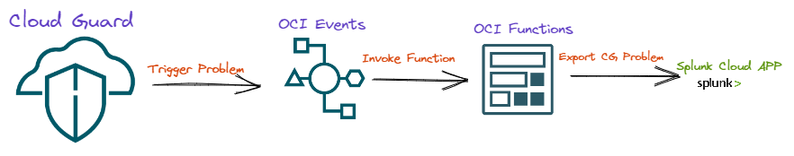

# Cloud Guard Splunk Integration
OCI Functions to Export OCI Cloud Guard Problems to Splunk via HEC


## Introduction
---
The Goal of the function is to export the OCI Cloud Guard Problems to Splunk via HTTP Event Collector (HEC). 



We will be using OCI Events to collect the problems from Cloud Guard and invoke it in the OCI functions to have it exported to the Splunk. 
In the image above it is mentioned that the problems are been exported to Splunk Colud app however it can be sent to Splunk Enterprise as well as long as it supports HEC. 


## Pre-requisites
---
1. OCI Tenancy with administrator access. 
2. Splunk hostname and HEC Token. 

## IAM Policies
---
**IAM Policy for the user to create and manange OCI Functions**

```OCI-Policy
Allow group <User Group> to manage repos in tenancy
Allow group <User Group> to manage repos in tenancy where ANY {request.permission = 'REPOSITORY_CREATE', request.permission = 'REPOSITORY_UPDATE'}
```

**Dynamic group for the function to authorize against OCI** 

```OCI-DynGrp
Any {resource.type = 'fnfunc', resource.compartment.id = 'ocid1.compartment.oc1..xxxx'}
```

**Attach the above dynamic group to a policy**

```OCI-Policy
FunctionsPolicy
Allow dynamic-group <Dynamic Group Name> to manage all-resources in compartment <Compartment Name>
```

Reference : [Policies to Control Access to Network and Function](#https://docs.oracle.com/en-us/iaas/Content/Functions/Tasks/functionscreatingpolicies.htm)

## Create and deploy the function
---
This example uses Cloud Shell environment for getting started with Cloud Shell Environment. From your cloud shell, 

1.  Find the name of the pre-created Fn Project context for the current region in which you created the application:
  
    ```
    fn list context
    ```

 At least two Fn Project contexts are returned, a default context and a context for the current region (for example, named us-phoenix-1).

2.  Set the Fn Project context to use the region context:
  
    ```
    fn use context <region-context>
    ```

    where `<region-context>` is the context for the current region. For example:

    ```
    fn use context us-phoenix-1
    ```

3.  Configure the Fn Project context with the OCID of the current compartment that will own deployed functions:

    ```
    fn update context oracle.compartment-id <compartment-ocid>
    ```

    For example:

    ```
    fn update context oracle.compartment-id ocid1.compartment.oc1..aaaaaaaarvdfa72n...
    ```

4.  Configure the Fn Project context with the Oracle Cloud Infrastructure Registry address in the current region and tenancy that you want to use with OCI Functions:

    ```
    fn update context registry <region-key>.ocir.io/<tenancy-namespace>/<repo-name-prefix>
    ```

    where `<repo-name-prefix>` is a prefix of your choosing for the Oracle Cloud Infrastructure Registry repository in which to store images for the function. For example:

    ```
    fn update context registry phx.ocir.io/ansh81vru1zp/acme-repo
    ```

5.  Configure the Fn Project context with the OCID of the compartment for repositories to and from which you want OCI Functions to push and pull function images, by entering:

    ```
    fn update context oracle.image-compartment-id <compartment-ocid>
    ```

    For example:

    ```
    fn update context oracle.image-compartment-id ocid1.compartment.oc1..aaaaaaaaquqe______z2q
    ```

    If you do not specify a value for `oracle.image-compartment-id`, OCI Functions pushes and pulls images to and from repositories in the root compartment.

6. [Generate auth token](https://docs.oracle.com/en-us/iaas/Content/Functions/Tasks/functionsquickstartcloudshell.htm#)

7.  Click **Generate an Auth Token** to display the **Auth Tokens** page, and click **Generate Token**.
    
    [](https://docs.oracle.com/en-us/iaas/Content/Functions/non-dita/quickstart-cloudshell/faas-generate-auth-token-window-1.png)
    
- Enter a meaningful description for the auth token in the **Generate Token** dialog, and click **Generate Token**. The new auth token is displayed (for example, 6aN...6MqX).
- Copy the auth token immediately to a secure location from where you can retrieve it later, because you won't see the auth token again in the Console.
- Close the **Generate Token** dialog.

**Login in to Registery:

8.  Copy the following command:

    ```
    docker login -u '<tenancy-namespace>/<user-name>' <region-key>.ocir.io
    ```

    For example:

    ```
    docker login -u 'ansh81vru1zp/jdoe@acme.com' phx.ocir.io
    ```

    If your tenancy is federated with Oracle Identity Cloud Service, the format will be slightly different. For example:

    ```
    docker login -u 'ansh81vru1zp/oracleidentitycloudservice/jdoe@acme.com' phx.ocir.io
    ```

9.  In the terminal window, paste the command you just copied and run it.
10.  When prompted for a password, enter the Oracle Cloud Infrastructure auth token that you created and copied earlier. For example, `6aN...6MqX`


Clone the code from [Github](#https://github.com/mukundmurali-mm/Cloud_Guard_Splunk.git)

In Cloud Shell, run the `fn deploy` command to build the function and its dependencies as a Docker image, push the image to the specified Docker registry, and deploy the function to Oracle Functions in the application created earlier: 

> cd Cloud_Guard_Splunk 

> ## Update the `func.yaml` with the Splunk hostname and HEC Token 

```
fn -v deploy --app <app-name>
``` 

Application is successfully deployed. 


## Test the Function 
---

Once there is a problem in created in Coud Guard it can validated from Splunk end but just to test if data is getting Pushed to Splunk we can invoke the function through a json file manually like this, 

> fn invoke myapp oci-logs-to-datadog-python < test.json


